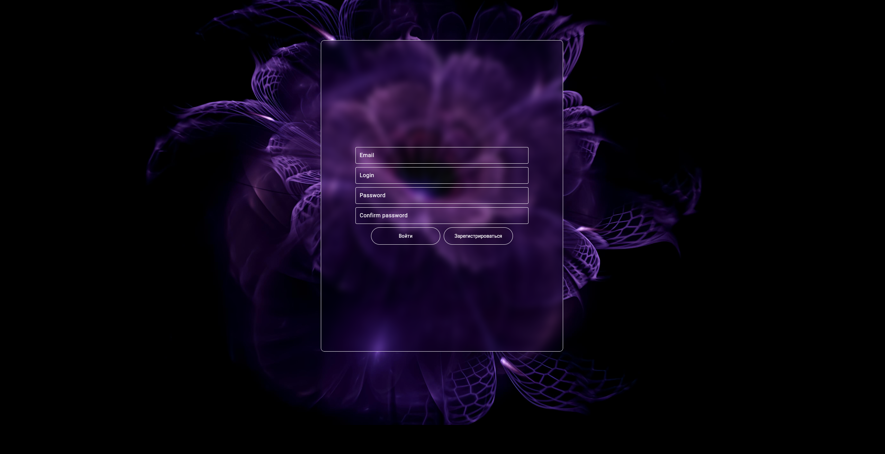
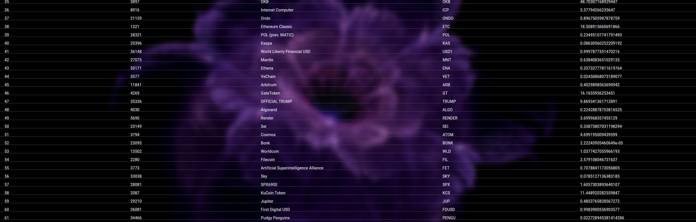
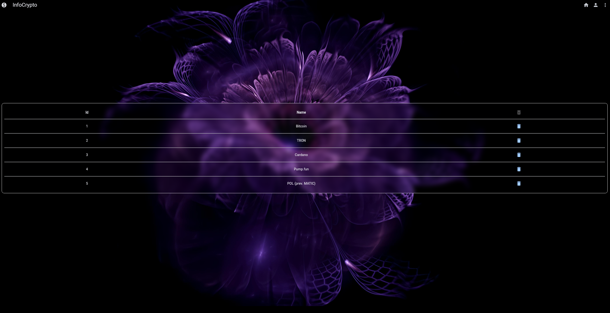
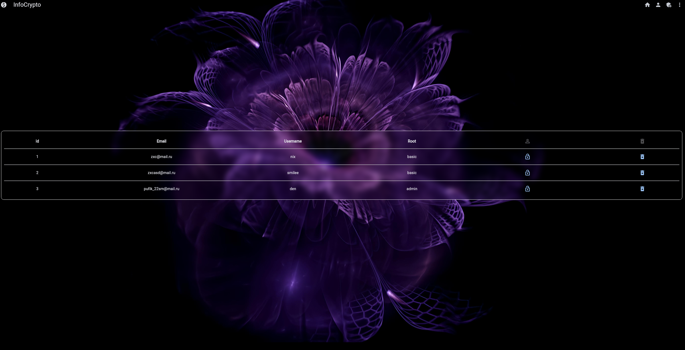
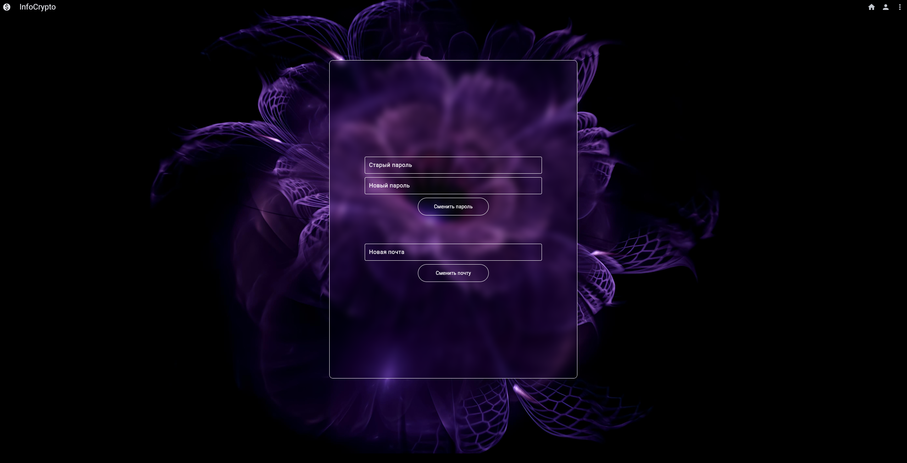

# 
 InfoCrypto
____
### About:
#### __Трекер криптовалют__
 - Простой сайт для отслеживания криптовалют по api, структура:
   - страница авторизации
   - главная страница криптовалют
   - личный кабинет пользователя
   - ~~админка~~ (в процессе)
 - Есть простая авторизация через jwt токены
 - Простая админка позволяющая управлять пользователями

___
### 
 Login page

  

### 
 Register page

  

### 
 Main page

  

### 
 Profile page

  

### 
 Admin page

  

### 
 Settings page

  

